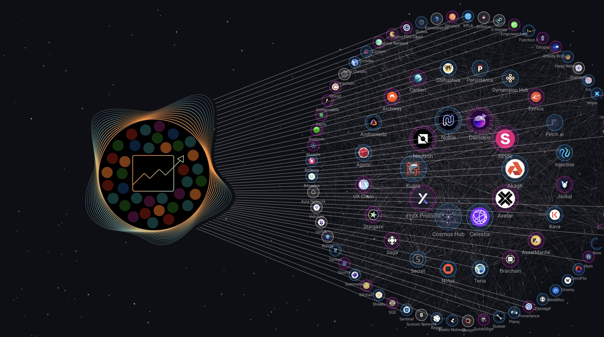

# Penumbra Guide

[Penumbra] is a fully private, cross-chain proof-of-stake network and
decentralized exchange for the Cosmos and beyond. Penumbra brings privacy to
IBC, allowing anyone to shield any IBC asset just by transferring it into
Penumbra's multi-asset shielded pool.  Within Penumbra, users can transact,
stake, swap, or marketmake without broadcasting their personal information to
the world.

<picture>
  
</picture>

Unlike a transparent chain, where all information is public, Penumbra is
end-to-end encrypted. 

## Using Penumbra on the web

The easiest way to get started using Penumbra is with the [Prax Wallet] web
extension.  The web extension runs entirely locally, and contains an
embedded ultralight node that syncs and decrypts only the data visible to your
wallet.  Websites can request to connect to your wallet and query your data.

The [_Using Penumbra on the web_](./web.md) chapter describes how to use
Penumbra on the web.

## Using Penumbra from the command line

Penumbra also has a command-line client, `pcli`.  Some protocol features, such
as threshold custody for shielded multisigs, do not yet have support in web
frontends and are only accessible via the command line.

The [_Using Penumbra from the command line_](./pcli.md) chapter describes how to
use `pcli`.

## Running a node

Running a node is not necessary to use the protocol. Both the web extension and
`pcli` are designed to operate with any RPC endpoint. However, we've tried to
make it as easy as possible to run nodes so that users can host their own RPC.

There are two kinds of Penumbra nodes:

* Penumbra fullnodes run `pd` and `cometbft` to synchronize and verify the entire chain state, as described in [_Running a node: `pd`_](./node/pd.md).
* Penumbra ultralight nodes run `pclientd` to scan, decrypt, and synchronize a specific wallet's data, as well as build and sign transactions, as described in [_Running a node: `pclientd`_](./node/pclientd.md).

The web extension and `pcli` embed the view and custody functionality provided
by `pclientd`, so it is not necessary to run `pclientd` to use them. Instead,
`pclientd` is intended to act as a local RPC for programmatic tooling (e.g.,
trading bots) not written in Rust that cannot easily embed the code for working
with Penumbra's shielded cryptography.

## Participating in development

Penumbra is a decentralized, open-source protocol, built in public.

The [_Participating in development_](./dev.md) chapter has developer
documentation for working on the protocol itself.

## Resources

The [_Resources_](./resources.md) chapter has links to other resources about the Penumbra protocol.

[protocol]: https://protocol.penumbra.zone
[rustdoc]: https://rustdoc.penumbra.zone
[Penumbra]: https://github.com/penumbra-zone/penumbra
[Prax Wallet]: https://chromewebstore.google.com/detail/prax-wallet/lkpmkhpnhknhmibgnmmhdhgdilepfghe
