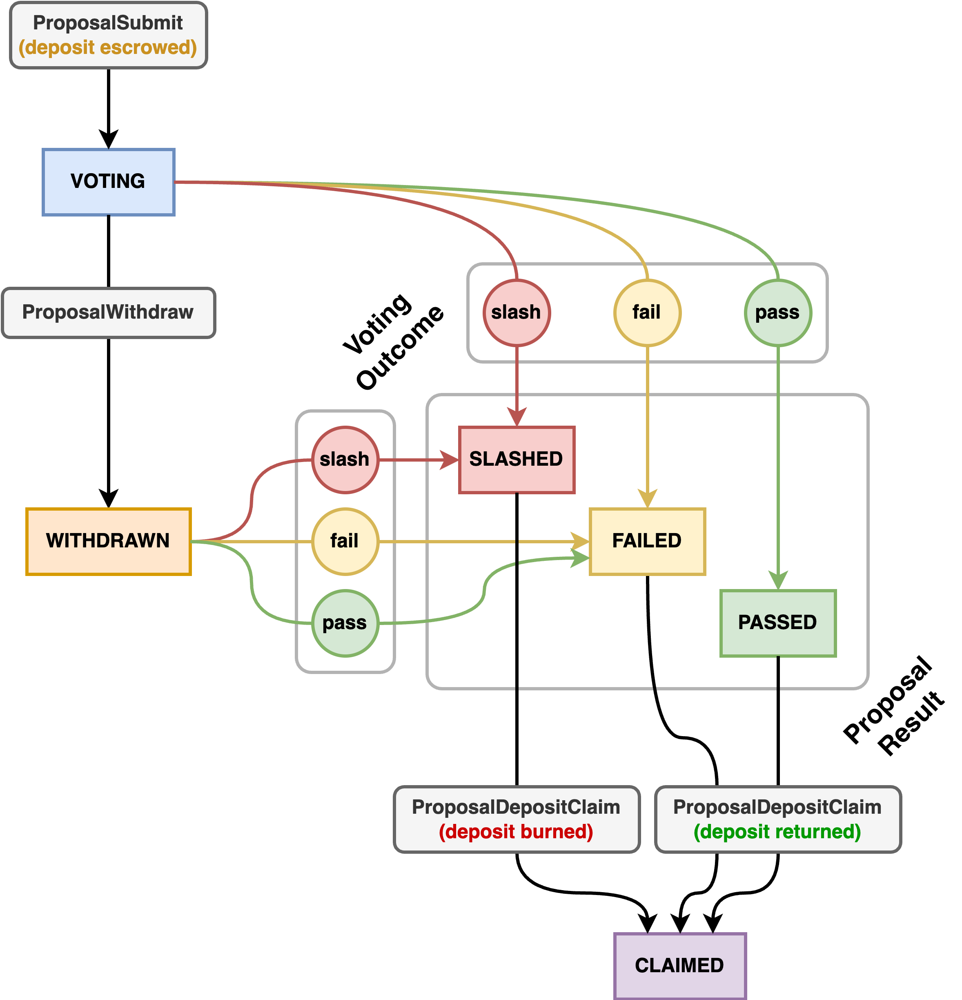

# Governance

Penumbra features on-chain governance similar to Cosmos Hub, with the simplification that there are
only 3 kinds of vote: yes, no, and abstain.

## Quick Start

There's a lot you can do with the governance system in Penumbra. If you have a particular intention
in mind, here are some quick links:

- [I am a _delegator_ and I want to vote on a proposal.](#voting-as-a-delegator)
- [I am a _validator_ and I want to vote on a proposal.](#voting-as-a-validator)
- [I want to learn about the different kinds of proposal.](#authoring-a-proposal)
- [I want to submit a new proposal.](#submitting-a-proposal)
- [I submitted a proposal and I want to withdraw it before voting concludes.](#withdrawing-a-proposal)
- [Voting has concluded on a proposal I submitted and I want to claim my deposit.](#claiming-a-proposal-deposit)
- [I want to contribute funds to the Community Pool.](#contributing-to-the-community-pool)

## Getting Proposal Information

To see information about the currently active proposals, including your own, use the `pcli query
proposal` subcommand.

To list all the active proposals by their ID, use:

```bash
pcli query governance list-proposals
```

Other proposal query commands all follow the form:

```bash
pcli query governance proposal [PROPOSAL_ID] [QUERY]
```

These are the queries currently defined:

- `definition` gets the details of a proposal, as the submitted JSON;
- `state` gets information about the current state of a proposal (voting, withdrawn, or finished,
  along with the reason for withdrawal if any, and the outcome of finished proposals);
- `period` gets the voting start and end block heights of a proposal;
- `tally` gets the current tally of a proposal's votes, as a total across all validators, and broken
  down by each validator's votes and the total votes of their delegators.

## Voting On A Proposal

Validators and delegators may both vote on proposals. Validator votes are public and attributable to
that validator; delegator votes are anonymous, revealing only the voting power used in the vote, and
the validator which the voting delegator had delegated to. Neither validators nor delegators can
change their votes after they have voted.

### Voting As A Delegator

If you had staked delegation tokens to one or more active validators when a proposal started, you
can vote on it using the `tx vote` subcommand of `pcli`. For example, if you wanted to vote "yes" on
proposal 1, you would do:

```bash
pcli tx vote yes --on 1
```

When you vote as a delegator (but _not_ when you vote as a validator), you will receive
commemorative `voted_on_N` tokens, where `N` is the proposal ID, proportionate to the weight of your
vote. Think of these as the cryptocurrency equivalent of the "I voted!" stickers you may have
received when voting in real life at your polling place.

### Voting As A Validator

If you are a validator who was active when the proposal started, you can vote on it using the
`validator vote` subcommand of `pcli`. For example, if you wanted to vote "yes" on proposal 1, you
would do:

```bash
pcli validator vote yes --on 1
```

### Eligibility And Voting Power

Only validators who were active at the time the proposal started voting may vote on proposals. Only
delegators who had staked delegation tokens to active validators at the time the proposal started
voting may vote on proposals.

A validator's voting power is equal to their voting power at the time a proposal started voting, and
a delegator's voting power is equal to the unbonded staking token value (i.e. the value in
`penumbra`) of the delegation tokens they had staked to an active validator at the time the proposal
started voting. When a delegator votes, their voting power is subtracted from the voting power of
the validator(s) to whom they had staked delegation notes at the time of the proposal start, and
their stake-weighted vote is added to the total of the votes: in other words, validators vote on
behalf of their delegators, but delegators may override their portion of their validator's vote.

## Authoring A Proposal

Anyone can submit a new governance proposal for voting by escrowing a _proposal deposit_, which will
be held until the end of the proposal's voting period. Penumbra's governance system discourages
proposal spam with a _slashing_ mechanism: proposals which receive more than a high threshold of no
votes have their deposit burned. At present, the slashing threshold is 80%. If the proposal is not
slashed (but regardless of whether it passes or fails), the deposit will then be returned to the
proposer at the end of voting.

From the proposer's point of view, the lifecycle of a proposal begins when it is
_submitted_ and ends when the deposit is _claimed_. During the voting period, the proposer may
also optionally _withdraw_ the proposal, which prevents it from passing, but does not prevent it
from being slashed. This is usually used when a proposal has been superseded by a revised
alternative.

<picture>
  <source srcset="../governance-dark.png" media="(prefers-color-scheme: dark)" />
  
</picture>

In the above, rounded grey boxes are actions submitted by the proposal author, rectangular colored
boxes are the state of the proposal on chain, and colored circles are outcomes of voting.

### Kinds Of Proposal

There are 4 kinds of governance proposal on Penumbra: **signaling**, **emergency**, **parameter
change**, and **community pool spend**.

#### Signaling Proposals

Signaling proposals are meant to signal community consensus about something. They do not have a
mechanized effect on the chain when passed; they merely indicate that the community agrees about
something.

This kind of proposal is often used to agree on code changes; as such, an optional `commit` field
may be included to specify these changes.

#### Emergency Proposals

Emergency proposals are meant for when immediate action is required to address a crisis, and
conclude early as soon as a 2/3 majority of all active voting power votes yes.

Emergency proposals have the power to optionally halt the chain when passed. If this occurs,
off-chain coordination between validators will be required to restart the chain.

#### Parameter Change Proposals

Parameter change proposals alter the chain parameters when they are passed. Chain parameters specify
things like the base staking reward rate, the amount of penalty applied when slashing, and other
properties that determine how the chain behaves. Many of these can be changed by parameter change
proposals, but some cannot, and instead would require a chain halt and upgrade.

A parameter change proposal specifies both the _old_ and the _new_ parameters. If the current set of
parameters at the time the proposal passes are an _exact match_ for the old parameters specified in
the proposal, the entire set of parameters is immediately set to the new parameters; otherwise,
nothing happens. This is to prevent two simultaneous parameter change proposals from overwriting
each others' changes or merging with one another into an undesired state. Almost always, the set of
old parameters should be the current parameters at the time the proposal is submitted.

#### Community Pool Spend Proposals

Community Pool spend proposals submit a _transaction plan_ which may spend funds from the Community Pool if passed.

Community Pool spend transactions have exclusive capability to use two special actions which are not allowed in
directly submitted user transactions: `CommunityPoolSpend` and `CommunityPoolOutput`. These actions, respectively, spend
funds from the Community Pool, and mint funds _transparently_ to an output address (unlike regular output
actions, which are shielded). Community Pool spend transactions are unable to use regular shielded outputs,
spend funds from any source other than the Community Pool itself, perform swaps, or submit, withdraw, or claim
governance proposals.

### Submitting A Proposal

To submit a proposal, first generate a proposal template for the kind of proposal you want to
submit. For example, suppose we want to create a signaling proposal:

```bash
pcli tx proposal template signaling --file proposal.toml
```

This outputs a TOML template for the proposal to the file `proposal.toml`, where you can edit the
details to match what you'd like to submit. The template will contain relevant default fields for
you to fill in, as well as a proposal ID, automatically set to the next proposal ID at the time you
generated the template. If someone else submits a proposal before you're ready to upload yours, you
may need to increment this ID, because it must be the sequentially next proposal ID at the time the
proposal is submitted to the chain.

Once you're ready to submit the proposal, you can submit it. Note that you do not have to explicitly
specify the proposal deposit in this action; it is determined automatically based on the chain
parameters.

```bash
pcli tx proposal submit --file proposal.toml
```

The proposal deposit will be immediately escrowed and the proposal voting period will start in the
very next block. As the proposer, you will receive a _proposal deposit NFT_ which can be redeemed
for the proposal deposit after voting concludes, provided the proposal is not slashed. This NFT has
denomination `proposal_N_deposit`, where `N` is the ID of your proposal. Note that _whoever holds
this NFT has exclusive control of the proposal_: they can withdraw it or claim the deposit.

#### Making A Community Pool Spend Transaction Plan

In order to submit a Community Pool spend proposal, it is necessary to create a transaction plan. At present,
the only way to specify this is to provide a rather human-unfriendly JSON-formatted transaction
plan, because there is no stable human-readable representation for a transaction plan at present.
This will change in the future as better tooling is developed.

For now, here is a template for a transaction plan that withdraws 100 penumbra from the Community Pool and
sends it to a specified address (in this case, the address of the author of this document):

```json
{
  "fee": { "amount": { "lo": 0, "hi": 0 } },
  "actions": [
    {
      "communityPoolSpend": {
        "value": {
          "amount": { "lo": 100000000, "hi": 0 },
          "assetId": { "inner": "KeqcLzNx9qSH5+lcJHBB9KNW+YPrBk5dKzvPMiypahA=" }
        }
      }
    },
    {
      "communityPoolOutput": {
        "value": {
          "amount": { "lo": 100000000, "hi": 0 },
          "assetId": { "inner": "KeqcLzNx9qSH5+lcJHBB9KNW+YPrBk5dKzvPMiypahA=" }
        },
        "address": {
          "inner": "vzZ60xfMPPwewTiSb08jk5OdUjc0BhQ7IXLgHAayJoi5mvmlnTpqFuaPU2hCBhwaEwO2c03tBbN/GVh0+CajAjYBmBq3yHAbzNJCnZS8jUs="
        }
      }
    }
  ]
}
```

Note that the asset ID and address are specified not in the usual bech32 formats you are used to
seeing, but in base64. To get your address in this format, use `pcli view address 0 --base64`.

To template a Community Pool spend proposal using a JSON transaction plan, use the `pcli tx proposal template
community-pool-spend --transaction-plan <FILENAME>.json`, which will take the transaction plan and include it
in the generated proposal template. If no plan is specified, the transaction plan will be the empty
transaction which does nothing when executed.

### Withdrawing A Proposal

If you want to withdraw a proposal that you have made (perhaps because a better proposal has come to
community consensus), you can do so before voting concludes. Note that this does not make you immune
to losing your deposit by slashing, as withdrawn proposals can still be voted on and slashed.

```bash
pcli tx proposal withdraw 0 \
    --reason "some human-readable reason for withdrawal"
```

When you withdraw a proposal, you _consume_ your proposal deposit NFT, and _produce_ a new _proposal
unbonding deposit NFT_, which has the denomination `proposal_N_unbonding_deposit`, where `N` is the
proposal ID. This, like the proposal deposit NFT, can be used to redeem the deposit at the end of
voting, provided the proposal is not slashed.

### Claiming A Proposal Deposit

Regardless of whether you have or have not withdrawn your proposal, once voting on the proposal
concludes, you can claim your proposal deposit using the `tx proposal deposit-claim` subcommand of
`pcli`. For example, if you wanted to claim the deposit for a concluded proposal number 1, you could
say:

```bash
pcli tx proposal deposit-claim 1
```

This will _consume_ your proposal deposit NFT (either the original or the one you received after
withdrawing the proposal) and send you back one of three different _proposal result NFTs_, depending
on the result of the vote: `proposal_N_passed`, `proposal_N_failed` or `proposal_N_slashed`. If the
proposal was not slashed (that is, it passed _or_ failed), this action will also produce the
original proposal deposit. Note that you _can_ claim a slashed proposal: you will receive the
slashed proposal result NFT, but you will not receive the original proposal deposit.

## Contributing To The Community Pool

Anyone can contribute any amount of any denomination to the Penumbra Community Pool. To do this, use the
command `pcli tx community-pool-deposit`, like so:

```bash
pcli tx community-pool-deposit 100penumbra
```

Funds contributed to the Community Pool cannot be withdrawn except by a successful Community Pool spend governance
proposal.

To query the current Community Pool balance, use `pcli query community-pool balance` with the **base denomination** of an
asset or its asset ID (display denominations are not currently accepted). For example:

```bash
pcli query Community Pool balance upenumbra
```

Community Pool spend proposals are only accepted for voting if they would not overdraw the current funds in the
Community Pool at the time the proposal is submitted, so it's worth checking this information before submitting
such a proposal.

### Sending Validator Funding Streams To The Community Pool

A validator may non-custodially send funds to the Community Pool, similarly to any other funding stream. To do
this, add a `[[funding_stream]]` section to your validator definition TOML file that declares the
Community Pool as a recipient for a funding stream. For example, your definition might look like this:

```toml
sequence_number = 0
enabled = true
name = "My Validator"
website = "https://example.com"
description = "An example validator"
identity_key = "penumbravalid1s6kgjgnphs99udwvyplwceh7phwt95dyn849je0jl0nptw78lcqqvcd65j"
governance_key = "penumbragovern1s6kgjgnphs99udwvyplwceh7phwt95dyn849je0jl0nptw78lcqqhknap5"

[consensus_key]
type = "tendermint/PubKeyEd25519"
value = "tDk3/k8zjEyDQjQC1jUyv8nJ1cC1B/MgrDzeWvBTGDM="

# Send a 1% commission to this address:
[[funding_stream]]
recipient = "penumbrav2t1hum845ches70c8kp8zfx7nerjwfe653hxsrpgwepwtspcp4jy6ytnxhe5kwn56sku684x6zzqcwp5ycrkee5mmg9kdl3jkr5lqn2xq3kqxvp4d7gwqdue5jznk2ter2t66mk4n"
rate_bps = 100

# Send another 1% commission to the Community Pool:
[[funding_stream]]
recipient = "CommunityPool"
rate_bps = 100
```
