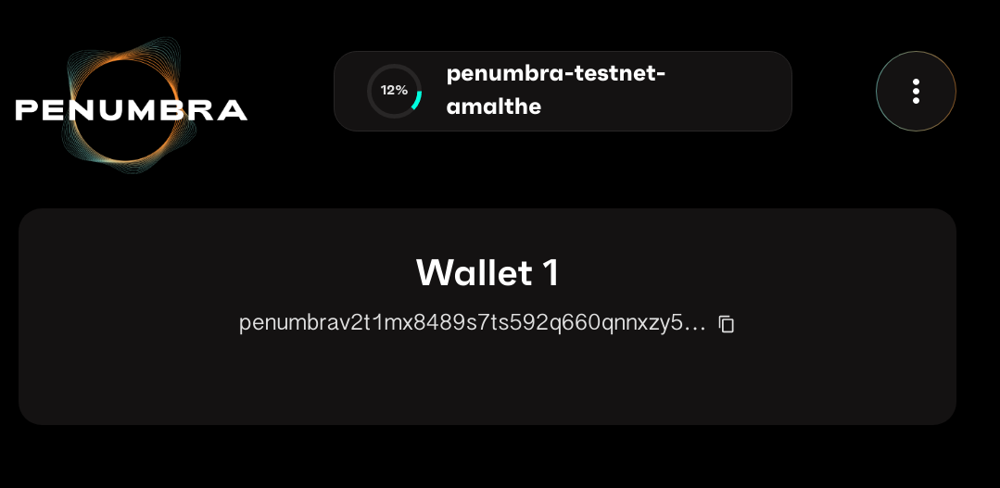

# Using the web extension

This section describes how to use the Penumbra Wallet web extension, a GUI client for Penumbra.

Currently, the web extension only supports a subset of functionality of the
command-line client, [`pcli`](./pcli.md).

## Installing the extension

The Penumbra Wallet web extension only supports the Google Chrome browser.
You must run Chrome in order to follow the instructions below.

1. Visit the Web Store page for the [Prax Wallet](https://chromewebstore.google.com/detail/prax-wallet/lkpmkhpnhknhmibgnmmhdhgdilepfghe),
   and click **Add to Chrome** to install it.
2. Navigate to the dApp website for the extension: [https://app.testnet.penumbra.zone/](https://app.testnet.penumbra.zone/),
   or [self-host your own frontend](./tutorials/running-frontend.md) and click **Connect** in the top-right corner.
3. Click **Get started** to proceed with wallet configuration.

## Generating a wallet

You'll be offered to import a pre-existing wallet. If you don't already have one, choose **Create a new wallet**.
During the guided tutorial, you'll need to set a passphrase to protect your wallet. The passphrase
is *not* the same as the recovery phrase. The passphrase is used to restrict access to the web wallet
on your computer. The recovery phrase can be used to import your wallet on a fresh installation, or
on a different machine. Make sure to store both the passphrase and the recovery phrase
securely, for example in a password manager.

Re-enter portions of the recovery phrase when prompted, to confirm that you've saved it properly.
Then you'll be taken to a screen that shows an initial synchronization process with the most
recent testnet:

<!--
Do we want to maintain screenshots inside the web extension docs?
The image files will become out of data quickly, requiring maintenance, and bloat the repo.
-->

<picture>
  <source srcset="web-extension-sync-progress.png" media="(prefers-color-scheme: dark)" />
  
</picture>

## Obtaining funds

In order to use the testnet, it's first necessary for you to get some testnet
tokens.  To obtain your address, click on the extension icon. The drop-down
should display your wallet address and a button to copy it to the clipboard.
Next, join our [Discord](https://discord.gg/hKvkrqa3zC) and post your address in
the `#testnet-faucet` channel.  We'll send your address some tokens on the
testnet for you to send to your friends! :)

In addition, addresses posted to the testnet faucet are periodically rolled into
the testnet genesis file, so that in future testnets your address will have
testnet tokens pre-loaded.

Just keep in mind: **testnet tokens do not have monetary value**, and in order
to keep the signal-to-noise ratio high on the server, requests for tokens in
other channels will be deleted without response. Please do not DM Penumbra Labs
employees asking for testnet tokens; the correct venue is the dedicated channel.

## Creating transactions

Now that you've got the web wallet configured, let's use it to send a
transaction.  Navigate to the dApp website:
[https://app.testnet.penumbra.zone/](https://app.testnet.penumbra.zone/) and
click **Connect**, then authorize the extension to work with the site. After
doing so, you'll see buttons for actions such as **Receive**, **Send**, and
**Exchange**.

As of Testnet 53, only the **Send** action is supported. Check back on
subsequent versions to follow progress as we implement more advanced
functionality in the web wallet.

## Upgrading to a new testnet

When a new testnet is released, you'll need to clear the existing state
from the extension, much like running `pcli view reset` is required
on the command-line. To synchronize with a new testnet:

1. Click the *Penumbra Wallet* option in the extensions drop-down menu,
   next to the URL bar.
2. Unlock the wallet by providing your passphrase, if prompted.
3. Click the gear icon in the top right corner of the overlay.
4. Choose **Advanced -> Clear Cache -> Confirm**.

Then navigate to [https://app.testnet.penumbra.zone/](https://app.testnet.penumbra.zone/)
again and reauthorize the connection. The extension will automatically sync
with the new chain.

## Updating to a new version of the extension

The extension should be automatically updated every time a new version is released.
You can view the latest version of the extension on the [Prax Wallet] page at the
Chrome Web Store. To force a check for updates:

1. Click the three-dot icon in the top right corner of the browser.
2. From the drop-down menu, choose **Extensions -> Manage Extensions**.
3. Select **Update** on the top panel.

After updating the extension manually, it may be helpful to clear the local cache,
as described above.

[Prax Wallet]: https://chromewebstore.google.com/detail/prax-wallet/lkpmkhpnhknhmibgnmmhdhgdilepfghe
