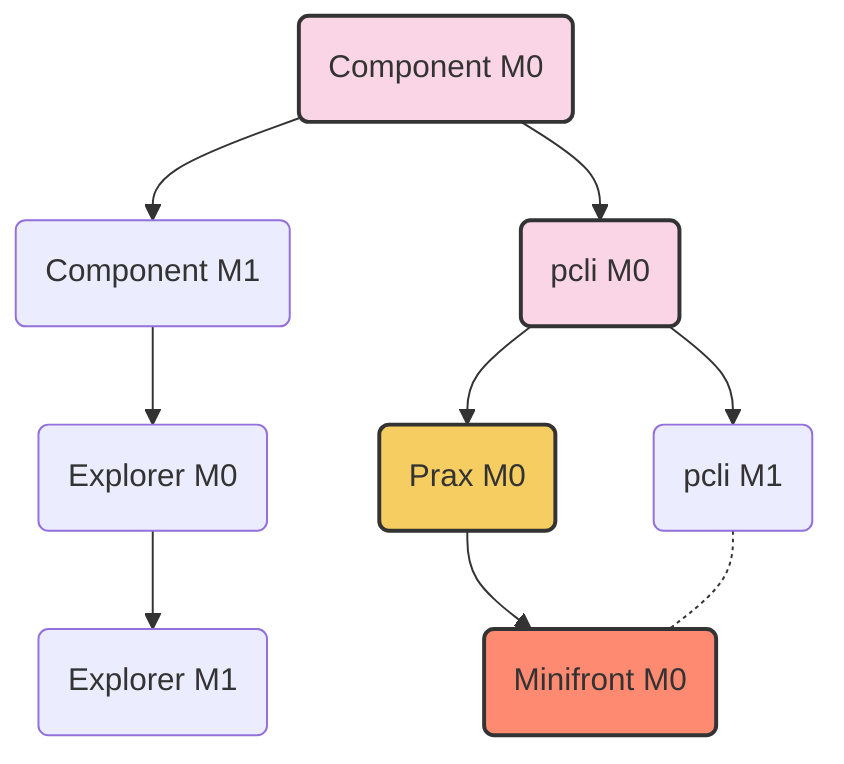

# Motivation

Penumbra has a powerful DEX engine, but currently the tooling for the DEX has focused on scenarios where trading happens on Penumbra but price discovery happens elsewhere.  We would like to have a better story about how price discovery (for any fungible asset) can happen on Penumbra itself.  This could help drive order flow and liquidity on the DEX.

Auctions are one tool to help accomplish price discovery. Auctions involve participants exchanging information about prices. As a private chain where control over information disclosure is natively supported and integrated through the entire stack, Penumbra is uniquely positioned to perform auctions, now and in the future.

To seed this capability, this note proposes an initial design for an _auction component_ to complement the existing DEX component. In the future, this component could manage many different kinds of auctions, with different tradeoffs and different privacy properties. The initial design, however, is narrowly scoped to a single type of auction: a (multi-unit) Dutch auction.

This choice has a number of desirable properties:

- The Dutch auction is shill-proof. Since actions on Penumbra are performed anonymously, there is no way to know whether the auctioneer is also submitting shill bids.
- Because it can be implemented using programmatic liquidity on the existing DEX, it does not involve new cryptography or complex engineering work, limiting the scope required to make it a useful product.
- Because it can be implemented using programmatic liquidity on the existing DEX, it synergizes with the existing product:
  - Users who auction tokens provide liquidity to the DEX engine, rather than segmenting "auction liquidity" and "DEX liquidity";
  - The DEX engine can perform internal arbitrage against existing DEX liquidity, acting as a "reserve bidder" if the auction price crosses the spread;
- As will be described below, the specific design allows client-side logic to implement a Gradual Dutch Auction by creating a single transaction that schedules multiple Dutch auctions over time.

## User Stories

A user has a number of tokens in Penumbra's shielded pool. They would like to sell some of them, but does not know exactly what they are worth, as (for whatever reason) there is no externally discovered price for the tokens. 

They open `minifront`, which they are using with Prax, aiming to discover how to accomplish this goal, ideally without having to leave Penumbra. The landing page for `minifront` shows them their asset balances and informs them that Penumbra's auction capabilities could accomplish their goal.

They navigate to the auction page and are walked through specifying the following parameters:

1. The amount of tokens they wish to sell, and what asset they wish to receive;
2. Their time preference, expressed as a slider with quantized values, e.g., 10min, 30min, 1h, 2h, 6h, 12h, 24h, 48h
3. The starting and reserve prices of the auction.

Based on the choice in (2), the frontend auto-selects two derived parameters:

* The number of sequential Dutch auctions to run, each auctioning $1/N$ of the input amount;
* The start and end time of each auction, which should be randomly but evenly-ish spaced over the specified time interval. [^1]

[^1]: random spacing ensures that if many users specify an auction with the same time preference at the same time, their individual auctions will be spread out rather than tightly clustered.

The frontend displays the auction plan to the user, who confirms it using Prax and submits the transaction.

After submission, the user can see their current auctions, one per row. Each row shows the status of the auction (queued / active / ended) and the current price and fill. If the action is queued or active, the row has a cancel button the user can use to cancel the auction (moving it to the ended state). If the auction is ended, the cancel button should be replaced by a claim button.

Once the user's auctions are completed, they can claim each auction individually or use a "claim all" button to claim them all at once.

## Auction Component

The auction component will be a new component of the Penumbra application. It will depend on the DEX component and use the public interfaces of the DEX, in particular the `PositionManager`.

### Data Structures

Each auction has a corresponding auction ID, similar to the way DEX `Position`s have a `PositionId`:

```proto
message AuctionId {
    bytes inner = 1;
}
```
As with DEX positions, each auction ID is
used to create a stateful bearer NFT used to track the ownership of the auction
and its proceeds.
```proto
message AuctionNft {
    AuctionId id = 1;
    uint64 seq = 2;
}
```
This data determines the denom string for the auction NFT,
```
auctionnft_{seq}_{bech32(id)}
auctionnft_0_paucid17cx8tf0l9476ep4vzktj65jt924a2e2f6njkfw39jnpd78xfp2zs0yastl
auctionnft_1_paucid17cx8tf0l9476ep4vzktj65jt924a2e2f6njkfw39jnpd78xfp2zs0yastl
auctionnft_2_paucid17cx8tf0l9476ep4vzktj65jt924a2e2f6njkfw39jnpd78xfp2zs0yastl
```
which is hashed to the asset ID for the auction NFT as with any other Penumbra asset. [^2]

[^2]: The `AuctionNft` is intended to be independent of the specific auction type, and extensible to future auction types.  Therefore, unlike DEX positions, we track state changes directly with a sequence number, rather than with an explicit enum (which in the case of the DEX, we later needed to add a sequence number to anyways, resulting in a regrettable enum-then-offset-sequence).

The immutable data describing a Dutch Auction is as follows:
```proto
// Describes a Dutch auction using programmatic liquidity on the DEX.
message DutchAuctionDescription {
    // The value the seller wishes to auction.
    asset.v1.Value input = 1;
    // The asset ID of the target asset the seller wishes to acquire.
    asset.v1.AssetId output = 2;
    // The maximum output the seller can receive.
    //
    // This implicitly defines the starting price for the auction.
    num.v1.Amount max_output = 3;
    // The minimum output the seller is willing to receive.
    //
    // This implicitly defines the ending price for the auction.
    num.v1.Amount min_output = 4;
    // The block height at which the auction begins.
    //
    // This allows the seller to schedule an auction at a future time.
    uint64 start_height = 5;
    // The block height at which the auction ends.
    //
    // Together with `start_height`, `max_output`, and `min_output`,
    // this implicitly defines the speed of the auction.
    uint64 end_height = 6;
    // The number of discrete price steps to use for the auction.
    //
    // `end_height - start_height` must be a multiple of `step_count`.
    uint64 step_count = 7;
    // A random nonce used to allow identical auctions to have
    // distinct auction IDs.
    bytes nonce = 8;
}
```
The auction ID for a DEX Dutch Auction is a hash of the encoded `DutchAuctionDescription` prefixed by the proto name.

The `DutchAuctionDescription` data is immutable.  The mutable state of the auction is recorded by the `DutchAuctionState` message:
```proto
message DutchAuctionState {
    // The sequence number of the auction state.
    //
    // Dutch auctions move from:
    // 0 (opened) => 1 (closed) => n (withdrawn)
    uint64 seq = 1;
    // If present, the current position controlled by this auction.
    dex.v1.PositionId current_position = 2;
    // If present, the next trigger height to step down the price.
    uint64 next_trigger = 3;
    // The amount of the input asset directly owned by the auction.
    //
    // The auction may also own the input asset indirectly,
    // via the reserves of `current_position` if it exists.
    num.v1.Amount input_reserves = 4;
    // The amount of the output asset directly owned by the auction.
    //
    // The auction may also own the output asset indirectly,
    // via the reserves of `current_position` if it exists.
    num.v1.Amount output_reserves = 5;
}
```
The current state of the auction is recorded by the `DutchAuction` message, which combines these two:
```proto
message DutchAuction {
    // The immutable data describing the auction and its auction ID.
    DutchAuctionDescription description = 1;
    // The mutable data describing the auction's execution.
    DutchAuctionState state = 2;
}
```

### Actions

Each component of the Penumbra application defines a set of `Action`s that can appear in user transactions -- which are atomically-executed bundles of `Action`s).  These are defined in protobufs. Unlike other components, we prefix the proto messages with `Action`, as we now do for events; this seems like it would have been a good idea for the other actions as well but given proto stabilization it's too late to change now.

The auction component's actions are as follows:

#### `ActionDutchAuctionSchedule`

```proto
// Initiates a Dutch auction using protocol-controlled liquidity.
message ActionDutchAuctionSchedule {
    DutchAuctionDescription description = 1;
}
```

The action describes and funds a new Dutch auction.

##### Value Balance

The action's effect on the transaction's value balance is to consume the input amount and produce an auction NFT controlling the auction:

| Value Balance Consumed | Value Balance Produced |
|-|-|
| $-$ (input value) | $+$ (auction nft, seq 0) |

Clients will presumably record the resulting auction NFT in the shielded pool using an `Output` action.

##### Gas Vector

The action's gas vector should account for the fact that it may open and then close `step_count` positions. However, we expect that using the auction action is substantially cheaper than client-side position management, because those positions are not tracked in the shielded pool and therefore don't incur compact block space costs.

| Gas Dimension | Cost |
|-|-|
| CompactBlock Space | 0 (no effect on compact block) |
| Block Space | byte size of proto |
| Verification | similar to `PositionOpen` |
| Execution | 2 * `step_count` * (`PositionOpen` + `PositionClose` cost) |

##### View

Although the action has no private data, it is useful to define a `View` that augments it with additional metadata to assist clients in rendering its contents:
```proto
// An `ActionDutchAuctionSchedule` augmented with additional metadata.
message ActionDutchAuctionScheduleView {
    AuctionDutchAuctionStart action = 1;
    AuctionId auction_id = 2;
    asset.v1.Metadata input_metadata = 3;
    asset.v1.Metadata output_metadata = 4;
}
```

#### `ActionDutchAuctionEnd`

```proto
// Ends a Dutch auction using protocol-controlled liquidity.
message ActionDutchAuctionEnd {
    // The auction to end.
    AuctionId auction_id = 1;
}
```

Ends a Dutch auction and advances the NFT state. If the auction has already ended this is a no-op.

##### Value Balance

The action's effect on the transaction's value balance is to advance the NFT state:

| Value Balance Consumed | Value Balance Produced |
|-|-|
| $-$ (auction nft, seq 0) | $+$ (auction nft, seq 1) |

This can be stacked with `ActionDutchAuctionWithdraw` to close and withdraw in a single transaction.

##### Gas Vector

| Gas Dimension | Cost |
|-|-|
| CompactBlock Space | 0 (no effect on compact block) |
| Block Space | byte size of proto |
| Verification | similar to `PositionClose` |
| Execution | similar to `PositionClose` |

##### View

The action is its own view.

#### `ActionDutchAuctionWithdraw`

```proto
// Withdraws the reserves of the auction.
message ActionDutchAuctionWithdraw {
    // The auction to withdraw funds from.
    AuctionId auction_id = 1;
    // The sequence number of the withdrawal.
    uint64 seq = 2;
    // A transparent (zero blinding factor) commitment to the 
    // auction's final reserves.
    //
    // The chain will check this commitment by recomputing it 
    // with the on-chain state.
    asset.v1.BalanceCommitment reserves_commitment = 2;
}
```

Withdraws the reserves of a completed auction. This resets the reserves to zero, so subsequent withdrawals are a no-op.

##### Value Balance

The action's effect on the transaction's value balance is to advance the NFT state and release the reserves:

| Value Balance Consumed | Value Balance Produced |
|-|-|
| $-$ (auction nft, `seq`) | $+$ (auction nft, `seq + 1`) |
| | $+$ auction value balance |

This can be stacked with `ActionDutchAuctionClose` to close and withdraw in a single transaction.  This is useful in the situation where the auction has already closed (e.g., by being filled), since the final reserves will be known to the client. However, since the client must supply the exact reserves to be withdrawn, if the auction remains open, a client would presumably want to split the close and the withdrawal across two transactions so that the reserves will not change while preparing the withdrawal.

##### Gas Vector

| Gas Dimension | Cost |
|-|-|
| CompactBlock Space | 0 (no effect on compact block) |
| Block Space | byte size of proto |
| Verification | similar to `PositionWithdraw` |
| Execution | similar to `PositionWithdraw` |

##### View

Although the action has no private data, it is useful to define a `View` that augments it with additional metadata to assist clients in rendering its contents:
```proto
// An `ActionDutchAuctionWithdraw` augmented with additional metadata.
message ActionDutchAuctionWithdrawView {
    AuctionDutchAuctionWithdraw action = 1;
    // A sequence of values that sum together to the provided 
    // reserves commitment.
    repeated asset.v1.ValueView reserves = 2;
}
```

### State Keys

**Design A (Chosen):** The auction component's state keys are laid out as follows:

- `auction/by_id/{auction_id} => Any<Auction>` stores a `google.protobuf.Any` of the auction state (for any auction type) by ID.
- `auction/dutch/trigger/{trigger_height:020}/{auction_id} => ()` records triggers for updating the auction state of `auction_id` at `trigger_height`. This allows iterating over all of the auctions that need to be processed at a given height (by performing a prefix query).

**Design B:** The auction component's state keys are laid out as follows:

- `auction/used_ids/{auction_id} => ()` records which IDs have been used (by any auction type).
- `auction/dutch/by_id/{auction_id} => DutchAuction` records the state of a Dutch auction.
- `auction/dutch/trigger/{trigger_height:020}/{auction_id} => ()` records triggers for updating the auction state of `auction_id` at `trigger_height`. This allows iterating over all of the auctions that need to be processed at a given height (by performing a prefix query).

In design A, we have a single place to look up the state of any auction and which IDs have been used, but we can't know the type of that state until we read it and inspect the `Any`. In design B, we have a single place to look up whether an ID has been used, but no way to determine what type of auction that is.  Given that we already want to have the `DutchAuctionDescription` hashed with the proto name to the auction ID (which is exactly the data of a protobuf `Any` type), design A may be preferable? (We chose design A).

The component does not maintain a list of all open auctions in the chain state, because this is not necessary for it to function.  Clients that want that information should consult an indexer.

### Component Logic

#### Handling `ActionDutchAuctionSchedule`

To process an `ActionDutchAuctionSchedule`, the component's handler checks that:

- The `step_count` evenly divides `end_height - start_height`, to determine the `block_interval` (so that `block_interval * step_count = end_height - start_height`);
- The `step_count` is less than 1000;
- The `start_height` is in the future;
- The `auction_id` is unused.

The `DutchAuction` has two parts, the `DutchAuctionDescription` and the
`DutchAuctionState`. The `DutchAuctionDescription` is provided by the action.
The initial `DutchAuctionState` is constructed as
```rust
DutchAuctionState {
    // The sequence number starts at 0.
    seq: 0,
    // No position has been created yet, this will occur at the first trigger.
    current_position: None,
    // Trigger processing when the auction is scheduled to start.
    next_trigger: description.start_height,
    // The amount to be auctioned has not yet been put in a position.
    input_reserves: description.input.amount,
    // No outputs have yet been received.
    output_reserves: 0,
}
```
The handler writes the resulting `DutchAuction` into the state.

Finally, the handler writes the key
```
auction/dutch/trigger/{start_height}/{auction_id}
```
to trigger processing of the auction when it is scheduled to start.

#### Handling `ActionDutchAuctionEnd`

To process an `ActionDutchAuctionEnd`, the component's handler reads the auction state and checks that the sequence number is `0` (opened) or `1` (ended). It updates the sequence number to `1`.

If `current_position` is `Some`, it closes and then withdraws the position's reserves, updating `input_reserves` and `output_reserves` as needed.

Then, it checks whether `next_trigger` is nonzero, and if so, unsets the trigger by deleting the relevant key from the state.

Finally, it writes the updated auction back to the state.

#### Handling `ActionDutchAuctionWithdraw`

To process an `ActionDutchAuctionWithdraw`, the component's handler reads the auction state and checks that the sequence number is at least `1` and matches the action's provided `seq` field.

Next, it checks that `Commit(input_reserves + output_reserves, 0)` is the provided reserves commitment.

Finally, it sets `input_reserves = 0`, `output_reserves = 0`, increments the auction's sequence number, and writes it back to the state.

#### Component methods

The auction component's only logic occurs in `EndBlock`. At the end of each block, the auction component checks for any triggers that have been set for that block height and processes them.

To process a trigger, the component reads the state of the triggered auction. Then, it determines what update should be performed for that auction and executes it:

1. If `current_position` is `Some`, close the position and withdraw its reserves back to the auction.
2. Delete the state key for the currently executing trigger.
3. Use the current height to compute the `step_number` (where `start_height` is `step_number = 0` and `end_height` is `step_number = step_count`)
4. If `step_number < step_count`, open a new position with the next price step and set a trigger for the next update. The position should have `close_on_fill = true`.
5. Otherwise, if `step_number >= step_count`, advance the auction's sequence number to `1` to mark the auction as ended.

### Fault Isolation

The auction component should have a value balance circuit breaker, copying code from the DEX component. The auction component's value balance should do accounting of value recorded by the auction component. Value flows into the auction component via `ActionDutchAuctionSchedule`. It flows out (into the DEX component) when moving value into a newly opened DEX position, and back in (out of the DEX component) when closing that position. Finally, it flows out of the auction component when withdrawing from an auction.

### Events

#### `EventValueCircuitBreakerCredit`

This is a copy of the same event in the DEX.
```proto
// Indicates that value was added to the Auction component.
message EventValueCircuitBreakerCredit {
  // The asset ID being deposited into the Auction component.
  asset.v1.AssetId asset_id = 1;
  // The previous balance of the asset in the Auction component.
  num.v1.Amount previous_balance = 2;
  // The new balance of the asset in the Auction component.
  num.v1.Amount new_balance = 3;
}
```

#### `EventValueCircuitBreakerDebit`

This is a copy of the same event in the DEX.
```proto
// Indicates that value is leaving the Auction component.
message EventValueCircuitBreakerDebit {
  // The asset ID being deposited into the Auction component.
  asset.v1.AssetId asset_id = 1;
  // The previous balance of the asset in the Auction component.
  num.v1.Amount previous_balance = 2;
  // The new balance of the asset in the Auction component.
  num.v1.Amount new_balance = 3;
}
```

#### `EventDutchAuctionScheduled`

Emitted by `ActionDutchAuctionSchedule`

Q: should this duplicate the fields of the `AuctionDescription` so that they end up in individual k/v pairs that are more easily queried?

#### `EventDutchAuctionUpdated`

Emitted when the Dutch auction is updated, with a new price and the amount remaining to be auctioned. Crucially, this should include the position ID of the position opened by the update and the position ID closed by the update (if any) so that the DEX `EventPositionOpen`/`EventPositionClose`/`EventPositionWithdraw` events can be crossreferenced with the auction.  This allows, for example, the DEX explorer to show that a position was opened "by auction XXXXX" rather than "by transaction YYYYY".

#### `EventDutchAuctionEnded`

Emitted when the Dutch auction ends. Should have a field indicating whether it was ended by the user (cancelled) or by being filled or by hitting the reserve price. Also should include the eventual average price.

### RPC Services

The fullnode should be queryable for the data it already maintains:

```proto
// Query operations for the auction component.
service QueryService {
  // Get the current state of an auction by ID.
  rpc AuctionStateById(AuctionStateByIdRequest) returns (AuctionStateByIdResponse);
  // Get the current state of a group of auctions by ID.
  rpc AuctionStateByIds(AuctionStateByIdsRequest) returns (stream AuctionStateByIdsResponse);
}

message AuctionStateByIdRequest {
    AuctionId id = 1;
}

message AuctionStateByIdResponse {
    // If present, the state of the auction. If not present, no such auction is known.
    google.protobuf.Any auction = 2;
    // The state of any DEX positions relevant to the returned auction.
    //
    // Could be empty, depending on the auction state.
    repeated core.component.dex.v1.Position positions = 3;
}

message AuctionStateByIdsRequest {
    // The auction IDs to request. Only known IDs will be returned in the response.
    repeated AuctionId id = 1;
}

message AuctionStateByIdsResponse {
    // The auction ID of the returned auction.
    AuctionId id = 1;
    // The state of the returned auction.
    google.protobuf.Any auction = 2;
    // The state of any DEX positions relevant to the returned auction.
    //
    // Could be empty, depending on the auction state.
    repeated core.component.dex.v1.Position positions = 3;
}
```

Including the `dex.v1.Position` in the response means that in the case of the Dutch auction, the complete state of the auction is available without an additional round trip.

## Client Support

We add the following methods to the `ViewService`:

```proto
service ViewService {
    // ...

    // Gets the auctions controlled by the user's wallet.
    rpc Auctions(AuctionsRequest) returns (stream AuctionsResponse);

    // ...
}

message AuctionsRequest {
    // If present, filter balances to only include the account specified by the `AddressIndex`.
    core.keys.v1.AddressIndex account_filter = 1;
    // If present, include inactive auctions as well as active ones.
    bool include_inactive = 2;
    // If set, query a fullnode for the current state of the auctions.
    bool query_latest_state = 3;
}

message AuctionsResponse {
    core.component.auction.v1.AuctionId id = 1;
    // The note recording the auction NFT.
    SpendableNoteRecord note_record = 4;

    // The state of the returned auction.
    //
    // Only present when `query_latest_state` was provided.
    google.protobuf.Any auction = 2;
    // The state of any DEX positions relevant to the returned auction.
    //
    // Only present when `query_latest_state` was provided.
    // Could be empty, depending on the auction state.
    repeated core.component.dex.v1.Position positions = 3;
}
```

Including the option to `query_latest_state` makes it easier for clients to get
the latest state without making additional RPC calls. While this is a privacy
leak, it's somewhat unavoidable for now. Making it the responsibility of the
view service internals will make it easier to improve in the future (we just
change one implementation and improve all clients).

For instance, a view server could save the terminal state of a completed auction
and avoid querying the chain for those auctions, returning them directly.

### Rust view server

The Rust view server will need to be updated to:

- Generate asset metadata for AuctionNFTs, akin to the existing code generating asset metadata for LPNFTs.
- Store a new table for tracking auctions. This only needs to have the minimal data to serve the `AuctionsRequest`: the auction ID and the state of the auction.
- Implement the new `AuctionsRequest` RPC.

### Prax view server

The Prax view server will need to be updated to:

- Generate asset metadata for AuctionNFTs, akin to the existing code generating asset metadata for LPNFTs.
- Store a new table for tracking auctions. This only needs to have the minimal data to serve the `AuctionsRequest`: the auction ID and the state of the auction.
- Implement the new `AuctionsRequest` RPC.

## UX

There are three pieces of software to update:

### pcli

This is the least important but easiest to implement.  Add the following commands to `pcli`:

* `pcli q auction id AUCTION_ID` queries an auction by ID;
* `pcli v auction list [--include-inactive]` prints a list of the auction IDs controlled by the user;
* `pcli tx auction dutch schedule 1234penumbra --into gm --start-price 8.3 --start-height 91000 --end-price 3.7 --end-height 92000 --num-steps 100` schedules an auction;
* `pcli tx auction dutch end AUCTION_ID` ends an auction by ID;
* `pcli tx auction dutch withdraw AUCTION_ID` ends/withdraws an auction by ID.

Optionally, we could add a command for gradual dutch auctions, to prototype that implementation prior to porting the logic to Typescript for `minifront`:

* `pcli tx auction gradual-dutch ...`

If we do this, it should have the high-level parameters we expect users to
specify in the GUI.

### minifront

The swap page should be changed to present users with a choice to swap at the current price or to perform an auction.  The auction flow is described in the user story above.

The UI should query the chain to try to provide reasonable defaults for knobs such as min and max price. The step count and number of sub-auctions can be queried from a hardcoded table based on the user specified time preference.

### DEX explorer

Auctions should be integrated into the DEX explorer in a few ways:

- A new auction page should show the state of an auction by ID. This can be similar to the current position by ID page.
- A new auctions by pair page should show a railway timetable diagram with the price curves of auctions scheduled for that pair, and a list of auctions (buy and sell) on that pair)
- When a price history / candlestick graph is added to the DEX explorer, auctions can be overlaid as diagonal lines on the chart.

## Implementation Plan

- The proto package for the new component should be `v1alpha1`; this is still going to cause breaking proto changes because we'll add new `Transaction` fields that use the `v1alpha1` types and then break them to point at the new package, but this shouldn't cause problems because other software won't use them and the entire project will be completed in a short time horizon.

We break the implementation into the following milestones:

| Milestone | Deliverable |
| -------- | -------- |
| Component M0 | Functional action handlers + basic RPC |
| Component M1 | Value balance accounting + full RPC + events |
| `pcli` M0 | We can record / execute / retire auctions in CLI    |
| `pcli` M1 | We can pass high-level parameters we want users to specify (time pref) and generate multiple DAs |
| Prax M0     | Update protos, react views for signing, view server updates |
| Minifront M0     | UI for gradual Dutch auctions     |
| Explorer M0    | Page displaying a DA     |
| Explorer M1    | Listing DAs / integrate into pair view |

with the following dependency relations:



Note that `pcli` M1 is not in itself a valuable product feature; the only reason to do it is to be able to parallelize the work of automatic parameter selection for GDAs so that the Minifront M0 can adapt or copy it.

The Component M0 and `pcli` M0 milestones should be done together, in keeping with our previous practice of using `pcli` as a testbed for new features. These should be done as soon as possible. Component functionality that doesn't affect the external action interfaces (e.g., value balance accounting, event emission, etc) can be deferred.
