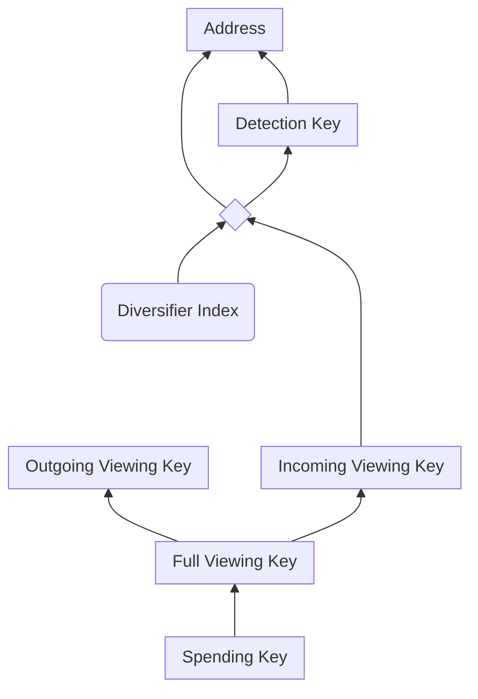

# Addresses and Keys

Value transferred on Penumbra is sent to *shielded payment addresses*; these
addresses are derived from *spending keys* through a sequence of intermediate
keys that represent different levels of attenuated capability:

From bottom to top:

- the *spending key* is the root capability, representing spending authority;
- the *full viewing key* represents the capability to view all transactions related to the spending authority;
- the *outgoing viewing key* represents the capability to view only outgoing transactions, and is used to recover information about previously sent transactions;
- the *incoming viewing key* represents the capability to view only incoming transactions, and is used to scan the block chain for incoming transactions.

Penumbra allows the same spending authority to present multiple, publicly
unlinkable addresses, keyed by an 11-byte *diversifier index*.  Each choice of
diversifier index gives a distinct shielded payment address. Because these
addresses share a common incoming viewing key, the cost of scanning the
blockchain does not increase with the number of addresses in use.

Finally, Penumbra also allows outsourcing *probabilistic* transaction detection
to third parties using [fuzzy message detection](../crypto/fmd.md).  Each
address has a *detection key*; a third party can use this key to detect
transactions that might be relevant to that key.  Like a Bloom filter, this
detection has false positives but no false negatives, so detection will find all
relevant transactions, as well as some amount of unrelated cover traffic.
Unlike incoming viewing keys, detection keys are not shared between diversified
addresses, allowing fine-grained control of delegation.

This diagram shows only the user-visible parts of the key hierarchy.
Internally, each of these keys has different components, described in detail in
the [Addresses and Keys](../protocol/addresses_keys.md) section of the
[Cryptographic Protocol](../protocol.md) chapter.
