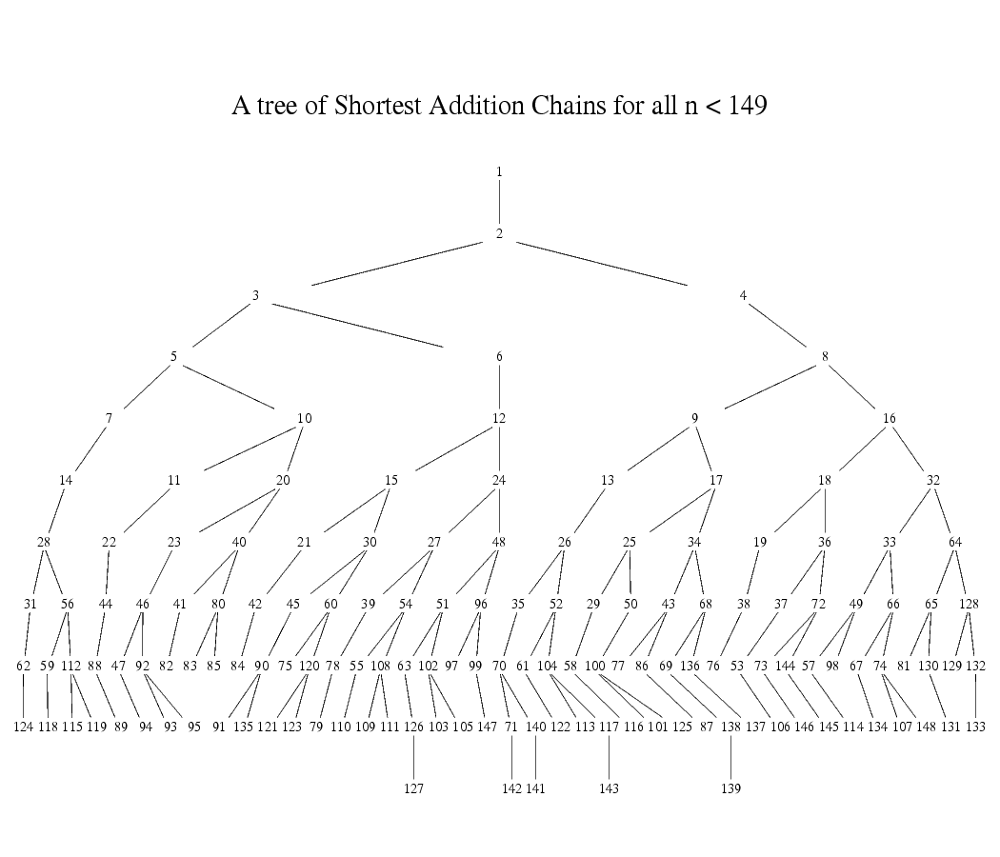

# Poseidon Parameter Generation

The problem of Poseidon parameter generation is to pick secure choices for the
parameters used in the permutation given the field, desired
security level $M$ in bits, as well as the width $t$ of the hash function one wants to
instantiate (i.e. 1:1 hash, 2:1 hash, etc.).

Poseidon parameters consist of:
* Choice of S-box: choosing the exponent $\alpha$ for the S-box layer where $S(x) = x^{\alpha}$,
* Round numbers: the numbers of partial and full rounds,
* Round constants: the constants to be added in the `AddRoundConstants` step,
* MDS Matrix: generating a Maximum Distance Separable (MDS) matrix to use in the linear layer,
where we multiply this matrix by the internal state.

Appendix B of the Poseidon paper provides sample implementations of both the Poseidon
permutation as well as parameter generation. There is a Python script called
`calc_round_numbers.py` which provides the round numbers given the security level
$M$, the width of the hash function $t$, as well as the choice of $\alpha$ used
in the S-box step. There is also a Sage script, which generates the round numbers,
constants, and MDS matrix, given the security level $M$, the width of the hash
function $t$, as well as the choice of $\alpha$ used in the S-box step.

Since the publication of the Poseidon paper, others have edited these scripts,
resulting in a number of implementations being in use derived from these initial
scripts. We elected to implement Poseidon parameter generation in Rust from
the paper, checking each step, and additionally automating the S-box parameter
selection step such that one can provide only the modulus of a prime field and
the best $\alpha$ will be selected.

Below we describe where we deviate from the parameter selection procedure
described in the text of the Poseidon paper.

## Choice of S-Box

The Poseidon paper focuses on the cases where $\alpha=[-1, 3, 5]$, as well as
BLS12-381 and BN254. For a choice of positive $\alpha$, it must satisfy $gcd(\alpha, p-1) = 1$,
where $p$ is the prime modulus.

For our use of Poseidon on BLS12-377, we wanted to generate a procedure for
selecting the optimal $\alpha$ for a general curve, which we describe below.

Given the following tree of [shortest addition chains]:

We proceed down the tree from depth 2 to depth 5 (where depth 0 is the root of 1):

1. At a given depth, proceed from right to left.
2. For a given element, check if $gcd(\alpha, p-1) = 1$ is satisfied. If yes, we choose it, else continue.

If we get through these checks to depth of 5 without finding a positive exponent
for $\alpha$, then we pick $\alpha = -1$, which is well-studied in the original
Poseidon paper.

## Round Numbers

We implement the round numbers as described in the original paper. These are the
number of rounds necessary to resist known attacks in the literature, plus a
security margin of +2 full rounds, and +7.5% partial rounds.

We test our round number calculations with tests from Appendices G and H from the paper
which contain concrete instantiations of Poseidon for $\alpha = [-1, 3, 5]$ and
their round numbers.

## Round Constants

We do not use the Grain LFSR for generating pseudorandom numbers as described
in Appendix F of the original paper. Instead, we use a [Merlin] transcript to
enable parameter generation to be fully deterministic and easily reproducible.

We bind this transcript to the input parameter choices: the width of the
hash function $t$, the security level $M$, and the modulus of the prime field $p$.
We also bind the transcript to the specific instance, as done with the Grain LFSR
in Appendix F, so we bind to the number of full rounds $R_F$, the number of partial
rounds $R_P$, as well as the choice of S-box exponent $\alpha$.

We generate random field elements from hashes of this complete [transcript] of
all the input parameters and the derived parameters $\alpha$, $R_F$, and $R_P$.

## MDS Matrix

We generate MDS matrices using the Cauchy method. However instead of randomly
sampling the field as described in the text, we follow the strategy of [Keller and Rosemarin 2020],
where we deterministically generate vectors $x$ and $y$ as:

$x = [0..t)$
$y = [t..2t)$

Each element $M_{ij}$ of the matrix is then constructed as:

$M_{ij} = \frac{1}{x_i + y_j}$

where $i, j \isin [0..t)$.

[Merlin]: https://merlin.cool/
[transcript]: https://github.com/penumbra-zone/poseidon377/blob/main/poseidon-paramgen/src/transcript.rs#L16
[Keller and Rosemarin 2020]: https://eprint.iacr.org/2020/179.pdf
[shortest addition chains]: https://wwwhomes.uni-bielefeld.de/achim/addition_chain.html