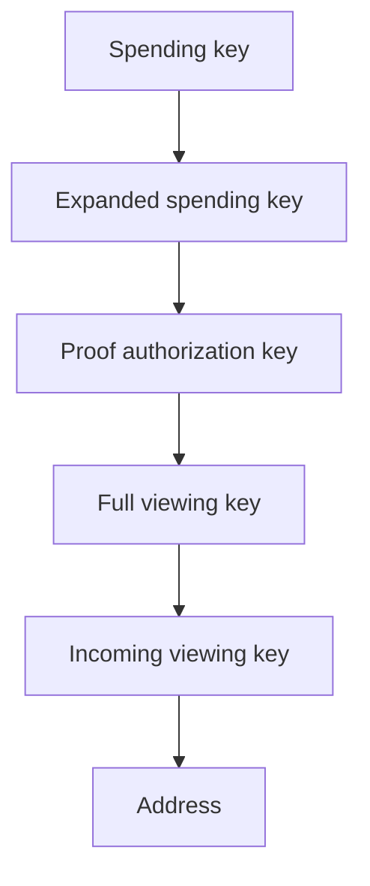

# Addresses and Keys

The key hierarchy is based on a modified [Zcash Sapling](https://github.com/zcash/zips/blob/main/protocol/sapling.pdf) design, which we summarize here.

All addresses and keys are ultimately derived from a secret *spending key* $sk$, which is a 32-byte random number. From this *spending key* $sk$, we derive several other keys, each described in more detail in its own section:

* an expanded form of the spending key called the [*expanded spending key*](./addresses_keys/expanded_spending_keys.md) which has components used to derive *viewing keys* and the *proof authorizion key* as described below,
* a [*proof authorization key*](./addresses_keys/proof_authorization_keys.md), which lets the holder spend notes associated with the *spending key*,
* [*viewing keys*](./addresses_keys/viewing_keys.md) which allow the holder to identify but not spend notes associated with the *spending key*,
* [*addresses*](./addresses_keys/addresses.md), which can be shared in order to receive payments.

The hierarchy at a high-level is shown in the following diagram:

# Implementation Notes

(will be moved soon into the relevant sections)

Keys are implemented as described in section 4.2 of the [Sapling Protocol Specification](https://github.com/zcash/zips/blob/main/protocol/sapling.pdf) and [ZIP 32](https://zips.z.cash/zip-0032) with the following changes:

* `JubJub` is replaced by `decaf377`.
* In "Sapling diversifier derivation" in ZIP 32, all diversifiers $d_j$ are valid. The default diversifier for an extended key is $d_0$. Similarly, in section 4.2.2 of the specification, the `CheckDiversifier` function returns only $d$, again as all diversifiers are valid.
* TK
