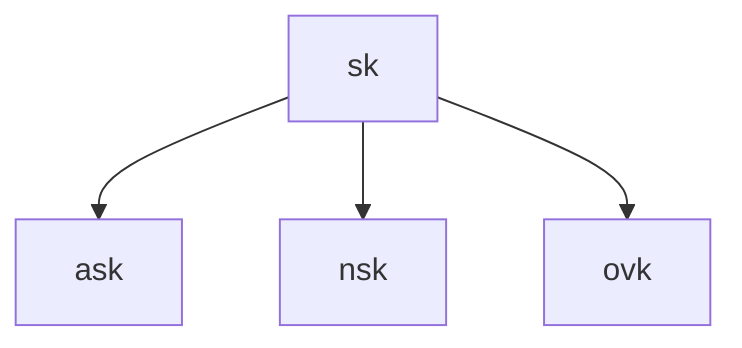

# Expanded Spending Keys

The *expanded spending key* has three components derived from the spending key *sk*:

These components are:

* $ask$, the *spend authorization key* which is a scalar value
* $nsk$, the *nullifier private key* which is a scalar value
* $ovk$, the *outgoing viewing key* which is a 32 byte number

The scalars are derived by hashing $sk$ along with a modifier value, then mapping to a scalar for the decaf377 curve:

$ask = ToScalar^{decaf377}( BLAKE2b-512(``Penumbra\_ExpandSeed", encode(sk) || 0 ) )$

$nsk = ToScalar^{decaf377}( BLAKE2b-512(``Penumbra\_ExpandSeed", encode(sk) || 1 ) $

The outgoing viewing key is derived by taking the first 32 bytes of the hash:

$ovk = truncate_{32}( BLAKE2b-512(``Penumbra\_ExpandSeed", encode(sk) || 2 )$

TODO: Can ask be 0? If yes, we need to discard $sk$ and $ask$ and generate a new $sk$.

TODO: Define encoding of sk, LEBS2OSP in Zcash spec

TODO: Define $ToScalar^{decaf377}$ function.

TODO: Poseidon instead of Blake2b?

TK: FMD flag key goes in here derived from $sk$?
