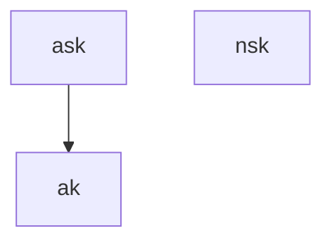

# Proof Authorization Keys

The *proof authorization key* has two components:

* $ak$, the *authorization key*, a point on the `decaf377` curve, derived from multiplying $ask$ (from the expanded spending key) by a fixed generator point on `decaf377`
* $nsk$, the *nullifier private key*, as defined in the [*expanded spending key*](./expanded_spending_keys.md) section,

The authorization key is derived by multiplying $ask$ by a generator point on the `decaf377` curve (this is analogous to `SpendAuthSig.DerivePublic` in the Zcash specification):

$ak = G_{a} * ask$

To spend notes, you must prove knowledge of $ak$, $nsk$, and $ask$.

## TODOs

- [ ] Define $G_{a}$ as this point: https://github.com/penumbra-zone/decaf377/blob/main/ristretto.sage#L689
- [ ] we (at some point) need to define Penumbra's version of $SpendAuthSig^{Sapling}$, described in \S 5.4.7.1 on p. 91 and \S 4.15 on p.54
