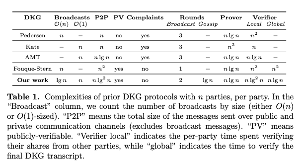

# Distributed Key Generation

A prerequisite for flow encryption in Penumbra is some distributed key
generation algorithm. Our [threshold encryption](./threshold-encryption.md)
scheme uses ElGamal and operates over the `decaf377` group, thus we must choose
a DKG which operates over `decaf377` outputs a `decaf377` public key. 

## Desired Properties

### Minimal Round Complexity

The DKG must be run by all validators at the start of every epoch. Ideally, the
DKG should be able to run in over a single block, such that there is no delay
between the start of the epoch and when users can delegate in the staking
system or trade on ZSwap. As such, for optimal UX and simplicity of
implementation, the optimal DKG for our scheme should have minimal round
complexity. Each round of communication can occur in the
[ABCI++](https://github.com/tendermint/spec/blob/master/rfc/004-abci%2B%2B.md)
vote extension phase. Since Tendermint votes already impose an `O(n^2)`
communication complexity for each block, minimal communication complexity is
not important for our DKG.

### Verifiability and Security Under Rogue-Key Attacks

In addition to minimal round complexity, our DKG must be *verifiable*:
participants (validators) must be able to verify that counterparty participants
(other validators) are contributing to the DKG honestly, without the use of a
trusted dealer. This can be achieved using something similar to [Feldman's
Verifiable Secret Sharing][feldman] protocol, where each participant shares a
commitment to their share which is visable to all other participants. In
addition, our DKG must be able to tolerate *rogue-key attacks*: that is, it
must tolerate the instance where a validator maliciously chooses their share
based on the value of the other validator's shares in order to cancel out other
validator's keyshares and gain unilateral control over the resulting DKG key.
One way this can be prevented is by each validator producing a proof of
knowledge of their secret share.

### Robustness

An additional property that our DKG should have is that of *robustness*. The
DKG should be able to tolerate a byzantine threshold of validators
intentionally refusing to participate in the DKG round, or intentionally
contributing malformed shares during DKG execution, without requiring a full
restart of the DKG protocol. This is due to DoS concerns: with a naive,
non-robust implementation, a single malicious validator could potentially
indefinitely delay the beginning of an epoch by refusing to participate in DKG
or by contributing invalid shares.

## A Survey of Existing DKGs

[Gurkan, Jovanovic, Maller, Meiklejohn, Stern, and Tomescu][GJMMST] present a survey of DKG instantiations with their communication complexity, public verifiablity, round complexity, prover, and verifier costs:

Note that *PV*, public verifiability, is slightly different than our
requirement of *verifiability*: public verifiability means that any
non-participating observer must be able to verify the correct execution of the
DKG.

Of the schemes listed, Fouque-Stern has the lowest round complexity, however
the scheme is uses Pallier which is not compatible with our encryption scheme.
The scheme described in that paper uses pairings, and thus is also not
compatible with our scheme. In addition, `O(n*log*n)` communication complexity
is not important for our scheme, since our vote extensions *already* require
`n^2` communication.

In addition to these schemes, [ETHDKG][ethdkg] is in use by Anoma and Osmosis
in
[Ferveo](https://anoma.network/blog/ferveo-a-distributed-key-generation-scheme-for-front-running-protection/).
However, this scheme is also not applicable to our threshold encryption scheme
as it is based on pairings rather than a discrete log DKG.

## FROST

Komlo and Goldberg introduced [FROST: Flexible Round-Optimized Schnorr
Threshold Signatures][frost]. FROST contains a DKG which is a slightly modified
version of Pedersen's DKG, modified to protect against rogue-key attacks. FROST
DKG operates on any prime order group where Decisional Diffie-Hellman is
difficult, and thus is compatible with `decaf377`. 

### Verifiability 

FROST DKG fulfills the requirement of verifiability and security under
rogue-key attacks. FROST DKG achieves this by slightly modifying Pedersen's DKG
to include a proof of knowledge of each participant's secret in the first round
of communication.

### Robustness

FROST DKG trades of simplicity and efficiency in favor of *robustness*. A
single participant can cause the DKG to abort by contributing an invalid share
or by refusing to produce a key share. [Gennaro, Jarecki, Krawczyk, and Tal
Rabin][gennaro] presented an alternative instantiation of Pedersen's DKG, which
can tolerate up to `n-t` invalid or missing shares. This is accomplished by
adding an additional *complaint* round, where participants can publish evidence
of a participant's invalid contribution and disqualify them from the DKG. A
similar strategy could be added to FROST DKG to adapt it to be robust.

### Round Complexity

By including an additional round for relaying complaints from each participant
to each counterparty, the round complexity of our DKG rises to 3 rounds.

### ABCI++ Implementation

A prerequisite for implementing any DKG scheme in Penumbra is
[ABCI++](https://github.com/tendermint/spec/blob/master/rfc/004-abci%2B%2B.md),
the extension to Tendermint which adds additional hooks to the Tendermint state
machine interface, most importantly vote extensions.

Implementing FROST DKG with ABCI++ can be done naively by placing each round of
communication in the Vote Extensions phase of ABCI++. This gives an upper bound
on the delay between the start of a new epoch and the completion of the DKG as
3 blocks: 1 block per vote extension communication round.

This could potentially be pipelined by including each participant's commitments for the next epoch (the commitments $a_{ij}*G$ from FROST) in the block data at one of the last blocks of the previous epoch. *Round 2* of FROST could occur during the vote extensions phase of the epoch transition block.

***NOTE***: FROST requries private communication channels for round 2, thus we
must assign validators encryption keys, perform key agreement, and encrypt
round 2 communications before placing them in the vote extension. This can be
accomplished using ECDH with `decaf377`, and an AEAD cipher (though
authentication is not strictly required, since vote extensions are signed). 

TODO:

[] concrete robust FROST implementation

[ethdkg]: https://eprint.iacr.org/2019/985
[feldman]: https://www.cs.umd.edu/~gasarch/TOPICS/secretsharing/feldmanVSS.pdf
[gennaro]: http://citeseerx.ist.psu.edu/viewdoc/download?doi=10.1.1.134.6445&rep=rep1&type=pdf
[GJMMST]: https://eprint.iacr.org/2021/005.pdf
[frost]: https://eprint.iacr.org/2020/852.pdf