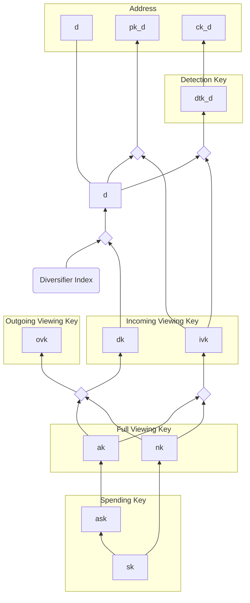

# Addresses and Keys

The key hierarchy is based on a modified [Zcash Sapling](https://zips.z.cash/protocol/protocol.pdf) design,
which we summarize here.  In contrast to Sapling, Penumbra's transaction system
includes support for [fuzzy message detection](./primitives/fmd.md), uses
Poseidon for hashing, and uses `decaf377` instead of Jubjub, so that it can be
used with the BLS12-377 curve instead of the BLS12-381 curve.

WARNING/TODO: this is a work-in-progress; only the diagram is currently roughly accurate.

All addresses and keys are ultimately derived from a secret *spending key* $sk$.
This is a random 32-byte string which acts as the root key material for a
particular spending authority. From this *spend key* $sk$, we derive several
other keys, each described in more detail in its own section:

* [*addresses*](./addresses_keys/addresses.md), which can be shared in order to receive payments.
