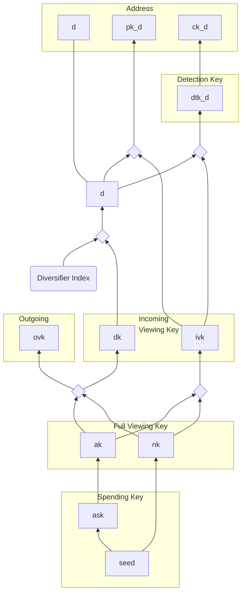

# Addresses and Keys

The key hierarchy is a modification of the design in Zcash [Sapling].  The main
differences are that it is designed for use with BLS12-377 rather than
BLS12-381, that it uses Poseidon as a hash and PRF, `decaf377` as the embedded
group, and that it includes support for [fuzzy message
detection](../crypto/fmd.md).

All key material within a particular spend authority is ultimately derived from
a single root secret.  The internal key components and their derivations are
described in the following sections:

* [Spending Keys](./addresses_keys/spend_key.md) describes derivation of the
  spending key from the root key material;
* [Viewing Keys](./addresses_keys/viewing_keys.md) describes derivation of the full, incoming, and outgoing viewing keys;
* [Addresses and Detection Keys](./addresses_keys/addresses.md) describes derivation of multiple, publicly unlinkable addresses for a single spending authority, each with their own detection key.

The diagram in the [Overview](../concepts/addresses_keys.md) section describes
the key hierarchy from an external, functional point of view.  Here, we zoom in
to the internal key components, whose relations are depicted in the following
diagram.  Each internal key component is represented with a box; arrows depict
key derivation steps, and diamond boxes represent key derivation steps that
combine multiple components.

[Sapling]: https://zips.z.cash/protocol/protocol.pdf
